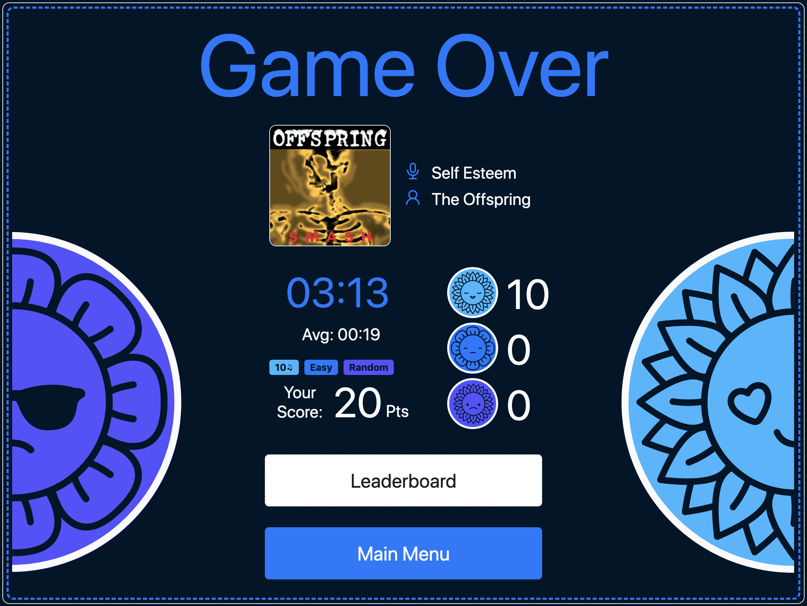

# Melody Mastermind

Melody Mastermind is a full-stack game testing music knowledge across multiple genres

## Contents
1. [Project Engineer](#projectEngineer)
2. [Technologies Used](#techUsed)
3. [Main Menu](#mainMenuFeatures)
4. [Settings](#settingsFeatures)
5. [In Game](#inGameFeatures)
6. [Game Over](#gameOverFeatures)
7. [Tutorial](#tutorialFeatures)
8. [Leaderboard](#leaderboardFeatures)
9. [Installation](#installation)

## Project Engineer 
### Erin Antoine
* https://github.com/erinantoine1
* https://www.linkedin.com/in/erin-antoine/

## Technologies Used 

 

 

 

## Main Menu 

-Navigation
<ul>
	<li><b>New Game:</b> To settings page (to create a new game)</li>
	<li><b>How to Play:</b> To game tutorial</li>
	<li><b>Leaderboard:</b> To scores/times</li>
</ul>

## Settings 

-Users are prompted to choose various settings for their new game  
<ul>
	<li><b>Name:</b> Name/nickname/username, limited to 20 characters (special chars/spaces allowed)</li>
	<li><b># of Songs:</b> The total number of songs to be quizzed on in your game (10, 20, 30)</li>
	<li><b>Difficulty:</b> The difficulty of your game (Easy, Medium, Hard)</li>
	<li><b>Genre:</b> The genre of the songs in your game (Random, Pop, Alt/Rock)</li>
</ul>
-Navigation
<ul>
	<li><b>x:</b> To main menu</li>
	<li><b>i:</b> To game tutorial</li>
</ul>

## In Game 

-The left panel contains important info for the user that remains visible/updated throughout the game
<ul>
	<li><b>Current Song #</b></li>
	<li><b>Performance Info:</b> Total game time, points scored, # correct/partially correct/incorrect</li>
	<li><b>Settings Info:</b> Game difficulty, song genre, total # of songs in game</li>
</ul>
-Navigation
<ul>
	<li><b>How to Play:</b> To game tutorial</li>
	<li><b>Leaderboard:</b> To scores/times</li>
	<li><b>Main Menu:</b> To main menu</li>
</ul>
-Animations in the center of the screen draw attention to where the user will directly interact with game   

 -Making A Guess
 <ul>
        <li>Type the song title and/or artist, then click 'Guess!' button or "Enter" key to submit guess</li>
        <li><b>Spelling counts, but punctuation/capitalization do not</b></li>
        <li><b>Unlimited guesses for each song</b> (until 'Give Up' button is pressed, or both song and artist correct)</li>
 </ul>
  -Scoring <b>(Easy Difficulty)</b>
        <ul>
          <li>Two points for correct song and artist</li>
          <li>One point for having either song title OR artist</li>
          <li>Zero points if neither are correct</li>
        </ul>
  -Scoring <b>(Medium Difficulty)</b>
        <ul>
          <li>Two points for correct song and artist</li>
          <li>Zero points if neither are correct</li>
        </ul>
  -Scoring <b>(Hard Difficulty)</b>
        <ul>
          <li>Two points for correct song and artist</li>
          <li>Zero points if neither are correct</li>
          <li>Limited to 3 lives (will be shown in left sidebar)</li>
          <li>Score is not added to leaderboard if you run out of lives</li>
        </ul>

## Game Over 

-A performance summary is provided once game has ended
        <ul>
          <li>Summary includes average time per song calculation</li>
	  <li>Info about final song also provided</li>
        </ul>
-Navigation
<ul>
	<li><b>Leaderboard:</b> To scores/times (will now include your score!)</li>
	<li><b>Main Menu:</b> To main menu</li>
</ul>

## Game Tutorial 

-Quick tutorial that simulates layout of the game while explaining step-by-step
        <ul>
          <li>Press the "Next" button to progress through the tutorial</li>
	  <li>Relevant elements of the game will be highlighted in each step</li>
        </ul>

## Leaderboard 

-Scores can be searched be genre, difficulty, or # of songs
        <ul>
		<li>Click on the corresponding dropdown to change the scores displayed</li>
		<li>To reset search criteria, press the "Reset" button</li>
        </ul>
-Navigation
<ul>
	<li><b>x:</b> To main menu</li>
	<li><b>i:</b> To game tutorial</li>
</ul>

## Installation 
1. Install packages using the following command

	`npm install`

2. Compile the project using webpack

	`npm run build`

3. Start the server

	`npm start`

4. Open project in web browser at

	`http://localhost:3000`
